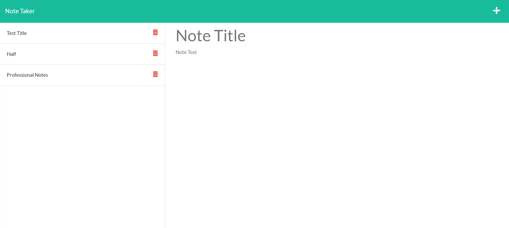

# note-taker

Note Taker is a note saving application that uses json files to store notes for later reading. 

## Use
To use Note Taker you only need to type out the idea or clever fact you wish to take note of, and press the save icon in the upper right hand corner. This will save your note to the left side of the screen for easy access later.

## Check me out on Github
https://github.com/andrewroddy92

## Link to app
https://note-taker-aroddy.herokuapp.com/